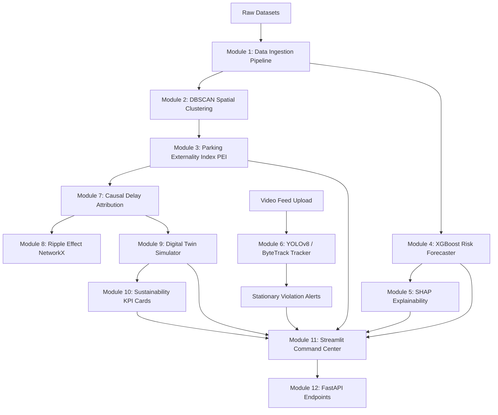

# PARKTWIN AI
> **"A Self-Learning Congestion-Aware Parking Intelligence Digital Twin"**

PARKTWIN AI is a hackathon-ready, production-inspired Smart City Traffic Command Center solution. It transforms illegal parking enforcement from a reactive, patrol-based process into proactive congestion intelligence. By identifying which violations matter most, estimating congestion delays, forecasting tomorrow's risks, and simulating policy interventions, it empowers municipal traffic planners to reduce urban traffic flow disruptions.

---

## 📌 Problem Statement

In rapidly growing metropolises, illegal parking is not just an enforcement nuisance; it is a primary driver of urban gridlock. 

### Why Existing Systems Fail
1. **Enforcement is Reactive**: Traffic police patrol streets randomly or respond only after a bottleneck has already formed.
2. **Lack of Traffic Attribution**: Existing solutions treat all violations equally (e.g., a car parked on an empty residential side street gets the same priority as one blocking a critical three-lane intersection during rush hour).
3. **No Forward Forecasting**: City planners cannot predict where bottlenecks will form tomorrow, leading to poorly allocated towing fleets.
4. **No Simulated Testing**: Traffic authorities cannot test the impact of fines, patrols, or towing policies before deploying them in the physical world.

---

## 🔮 Solution Overview & Innovations

ParkTwin AI builds a **Digital Twin** of the city's traffic flow by fusing historical violation records, geospatial clustering, predictive forecasting, live computer vision tracking, and graph-based congestion routing:
* **Adaptive Data Ingestion**: Auto-detects encoding, standardizes inputs, and generates data quality reports.
* **Geospatial Hotspots (DBSCAN)**: Aggregates scattered violation points into distinct spatial-temporal clusters.
* **Parking Externality Index (PEI)**: A multi-criteria scoring algorithm that ranks hotspots by their true traffic burden.
* **Predictive Forecasting (XGBoost)**: Forecasts tomorrow's risk probability by hour and jurisdiction.
* **Explainable AI (SHAP)**: Employs game-theoretic SHAP values to explain model decisions.
* **Real-time Edge Vision**: Detects vehicles using YOLOv8, tracks individual vehicle IDs (ByteTrack), measures stationary durations, and alerts traffic controllers.
* **Network Graph Ripple propagation (NetworkX)**: Propagates primary delays to secondary and tertiary zones to estimate traffic spillover.
* **Digital Twin Simulator**: Let users test policies (Towing, Fines, Patrols) to see projected reductions in vehicle hours lost and carbon footprint.

---

## 🛠️ System Architecture



---

## 📂 Folder Structure

```
ParkTwin-AI/
│
├── dataset/                    # Stores CSV files (historical-dataset.csv)
├── app/                        # Main entry point and backend models
│   ├── config.py               # Shared configurations and thresholds
│   └── data_pipeline.py        # Ingestion, cleaning, standardizing
├── services/                   # Business logic layers
│   ├── hotspot_service.py      # DBSCAN clustering & spatial queries
│   ├── pei_service.py          # PEI scoring and leaderboard
│   ├── forecast_service.py     # XGBoost trainer and forecaster
│   ├── explainability_service.py # SHAP generation
│   ├── detection_service.py    # YOLOv8 + ByteTrack + stationary tracking
│   ├── delay_service.py        # Causal delay and NetworkX ripple analyzer
│   └── simulation_service.py   # Intervention simulator
├── dashboard/                  # Streamlit frontend pages
│   └── app.py                  # Streamlit Multi-page main app
├── api/                        # FastAPI endpoints
│   └── main.py                 # FastAPI router and Swagger docs
├── models/                     # Serialized models and components
├── utils/                      # Helper utilities
├── outputs/                    # Output directories (explanations, reports, etc.)
├── tests/                      # pytest test suite
│   └── test_parktwin.py        # Integrated tests
├── requirements.txt            # Python dependencies
├── README.md                   # System documentation
├── run.sh                      # Shell script for Linux/macOS
├── run.bat                     # Batch script for Windows execution
└── main.py                     # Unified launcher
```

---

## 🚀 Installation & Running Instructions

### Prerequisites
* Python 3.10
* Windows, Linux, or macOS

### Automatic Quickstart
Simply run the startup batch file (Windows) or shell script (Unix) which automatically installs dependencies, runs model training, and starts the API and Dashboard services:

**For Windows:**
```cmd
run.bat
```

**For Linux/macOS:**
```bash
chmod +x run.sh
./run.sh
```

---

### Manual Commands

If you prefer to run the components individually:

1. **Install Dependencies:**
   ```bash
   pip install -r requirements.txt
   ```

2. **Run ML Pre-training & SHAP Plot Generation:**
   ```bash
   python main.py --train
   ```

3. **Start the FastAPI Backend Server:**
   ```bash
   python main.py --api
   ```
   * *Swagger API documentation will be available at:* [http://127.0.0.1:8000/docs](http://127.0.0.1:8000/docs)

4. **Start the Streamlit Command Center Dashboard:**
   ```bash
   python main.py --dashboard
   ```
   * *The web interface will open at:* [http://localhost:8501](http://localhost:8501)

5. **Run the Automated Test Suite:**
   ```bash
   python main.py --test
   ```

---

## 🎮 Demo Workflow

1. **Overview**: Observe citywide KPIs, total violations, and maps showing spatial density.
2. **Hotspot Explorer**: Explore clusters generated by DBSCAN and analyze time-of-day traffic patterns.
3. **PEI Dashboard**: View the prioritized list of hotspots. See which named junctions present the highest risk.
4. **Forecasting**: Click "Generate Tomorrow's Forecast" to run the XGBoost predictor and review the top 10 predicted hourly risk slots.
5. **Live Detection**: Go to the "Live Detection" tab, configure the stationary threshold, and click "Run Live Detection Simulation" (or upload your own traffic video) to see vehicle tracking and real-time alerts.
6. **Digital Twin Simulator**: Select a critical intersection and apply an intervention (e.g. "Tow Vehicle"). Review the 24-hour projected savings graph. Click **"Lock Simulation"** to save it to memory.
7. **Explainability**: Review the SHAP waterfall and summary plots explaining the machine learning decisions.
8. **Sustainability Impact**: Look at the accumulated metric cards (Fuel Saved, CO2 Offset, Dollars Saved) resulting from your simulated policy interventions.

---

## 💡 Innovation Highlights (The PEI Model)

The primary mathematical engine is the **Parking Externality Index (PEI)**, calculated as:
$$PEI = 0.30 \\times Freq + 0.25 \\times AvgDuration + 0.20 \\times PeakSeverity + 0.15 \\times JunctionCriticality + 0.10 \\times RealTimeDensity$$

This index ensures that enforcement resources are directed where they will yield the greatest congestion relief and environmental benefit.

---

## ⚡ Future Enhancements
* **Reinforcement Learning Enforcement Allocation**: Train agents to dynamic schedule patrols.
* **ANPR Integration**: Automatically track repeat offenders using Automatic Number Plate Recognition.
* **SUMO Integration**: Bind the digital twin to a SUMO (Simulation of Urban MObility) network.
* **Multi-Camera Fusion**: Track vehicles across adjacent camera views to build comprehensive trajectory models.
* **Edge Deployment**: Optimize the YOLO/ByteTrack pipeline to run on Nvidia Jetson modules.

---

## 🎤 Hackathon Pitch: ParkTwin AI

*"Every day, major cities waste millions of hours and gallons of fuel in traffic jams caused by a single vehicle double-parked on a main road. ParkTwin AI builds a congestion-aware digital twin that identifies not just where illegal parking happens, but where it causes the most damage. By routing tow trucks to high-PEI locations and simulating policy interventions before deployment, we save cities time, money, and tons of carbon emissions."*
