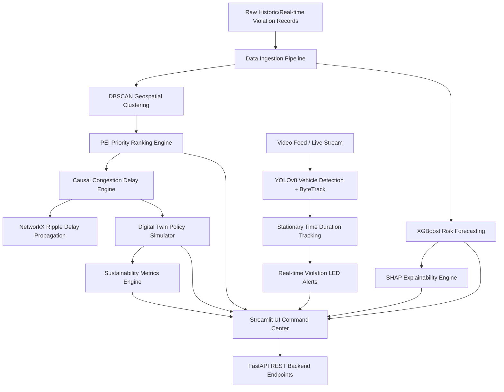

# PARKTWIN AI: COMPLETE APPLICATION IMPLEMENTATION SPECIFICATION

This document provides a detailed overview of the modules, analytical components, algorithms, and visualization elements implemented in the **ParkTwin AI Traffic Command Center** application.

---

## 🗺️ 1. Architectural Blueprint & Data Flow

ParkTwin AI integrates physical computer vision tracking, geographical spatial clustering, and predictive forecasting to build a proactive congestion command center:

---

## 🛠️ 2. Core Backend Services & Algorithms

The application's analytics, simulations, and processing engines are modularized under the `services/` and `app/` directories:

### 2.1. Ingestion Pipeline & Configurations
* **Files**: [data_pipeline.py](file:///d:/fullstack/ParkTwin-AI/app/data_pipeline.py), [config.py](file:///d:/fullstack/ParkTwin-AI/app/config.py)
* **Functionality**:
  * **Auto-Encoding Search**: Scans and parses dataset files (`historical-dataset.csv`) using a try-list (`['utf-8', 'latin-1', 'cp1252']`) to prevent ingestion failures.
  * **Column Mapping Normalization**: Automatically aligns differing casing and spacing in source tables to standardized targets (`latitude`, `longitude`, `created_datetime`, `closed_datetime`, `police_station`, `junction`, `vehicle_type`, `vehicle_number`).
  * **Duration Calculation**: Computes duration of blockage in minutes for each incident record:
    $$\Delta t = t_{\text{closed}} - t_{\text{created}}$$
  * **Temporal Feature Engineering**: Extracts temporal features like `hour`, `day_of_week`, `is_weekend`, `month`, and `rush_hour_flag` (morning rush: 7:00–9:00, evening rush: 17:00–19:00).

### 2.2. DBSCAN Spatial-Temporal Clustering
* **File**: [hotspot_service.py](file:///d:/fullstack/ParkTwin-AI/services/hotspot_service.py)
* **Functionality**:
  * **Haversine DBSCAN Clustering**: Clusters raw GPS coordinate points representing illegal parking violations using Haversine distance.
  * **Configurable Spatial Constraints**: Scans coordinates with `eps = 0.05 / 6371` (50 meters radian radius on the Earth's surface) and `min_samples = 3` to detect spatial densities.
  * **Hotspot Aggregation**: Combines scattered data into high-density zones, computing centroid coordinates, total violation counts, average duration, and peak hour ratios (the fraction of violations occurring during rush hours).

### 2.3. Parking Externality Index (PEI) Ranking Engine
* **File**: [pei_service.py](file:///d:/fullstack/ParkTwin-AI/services/pei_service.py)
* **Functionality**:
  * **PEI Formula**: Calculates a multi-criteria scoring index ranging from $0.0$ to $100.0$ to represent the traffic blockage severity of a cluster:
    $$PEI = 0.30 \times F_{\text{req}} + 0.25 \times D_{\text{ur}} + 0.20 \times P_{\text{eak}} + 0.15 \times J_{\text{unc}} + 0.10 \times D_{\text{ens}}$$
    * $F_{\text{req}}$ (Frequency Score): Normalized violation count.
    * $D_{\text{ur}}$ (Duration Score): Average stationary duration capped at $240$ minutes and scaled.
    * $P_{\text{eak}}$ (Peak Severity Score): Ratio of rush hour blockages.
    * $J_{\text{unc}}$ (Junction Criticality Score): $100$ if nearby a designated named intersection, $20$ otherwise.
    * $D_{\text{ens}}$ (Density Score): Logarithmic scaling of violation occurrences to capture bottleneck compound rates.
  * **Severity Labeling**: Assigns enforcement levels based on scores:
    * `Moderate`: $\le 40$
    * `High`: $40 < \text{PEI} \le 70$
    * `Critical`: $> 70$

### 2.4. Congestion Delay & Network Ripple Graph
* **File**: [delay_service.py](file:///d:/fullstack/ParkTwin-AI/services/delay_service.py)
* **Functionality**:
  * **Vehicle-Hours Lost (VHL)**: Quantifies delay based on average baseline traffic flow rate (default $600\text{ vhl/hr}$), junction proximity factor (multiplies by $2.5\times$), and PEI risk scaling factor:
    $$\text{VHL} = \left(\frac{\text{Delay per affected vehicle in minutes}}{60}\right) \times \text{Traffic volume passing by during blockage}$$
  * **NetworkX Spillover Propagation**: Generates a directed spatial network graph (`DiGraph`) where primary delay propagates dynamically to adjacent intersections:
    * Secondary intersection zone (first-degree hop): inherits $50\%$ spillover delay.
    * Tertiary intersection zone (second-degree hop): inherits $20\%$ spillover delay.
  * **Total Spillover Calculation**: Computes the network-wide cumulative congestion footprint of local blockages.

### 2.5. Digital Twin Simulator Engine
* **File**: [simulation_service.py](file:///d:/fullstack/ParkTwin-AI/services/simulation_service.py)
* **Functionality**:
  * **Intervention Reductions**: Models structural policy actions on traffic flow bottlenecks:
    * *Officer Patrol*: $50\%$ frequency reduction, $25\%$ duration reduction.
    * *Tow Vehicle*: $80\%$ duration reduction (removing blockage quickly).
    * *Barricading*: $40\%$ frequency reduction, $10\%$ duration reduction.
    * *Fine Only*: $30\%$ frequency reduction.
  * **Dynamic 24-Hour Profile**: Projects recovery slopes across standard morning and evening commute peak periods.
  * **Carbon & Fiscal Economics**:
    * Idling fuel rate: Wastes $1.2\text{ liters/hour}$ of fuel.
    * CO2 generation: $2.31\text{ kg CO}_2$ emitted per liter of gasoline.
    * Monetary conversion: Wasted time valued at $\$15.00/\text{hour}$; fuel cost valued at $\$1.15/\text{liter}$.

### 2.6. XGBoost Risk Forecasting Core
* **File**: [forecast_service.py](file:///d:/fullstack/ParkTwin-AI/services/forecast_service.py)
* **Functionality**:
  * **Model Architecture**: Trains an XGBoost Classifier on engineered temporal variables to predict binary high-congestion-risk events.
  * **Evaluation Metrics**: Logs accuracy, precision, recall, F1-score, and ROC-AUC curve matrices in the dashboard footer.
  * **Risk Timeline Forecasting**: Predicts a 24-hour ahead probability trend line for any municipal jurisdiction.

### 2.7. SHAP Game-Theoretic Explainability
* **File**: [explainability_service.py](file:///d:/fullstack/ParkTwin-AI/services/explainability_service.py)
* **Functionality**:
  * **SHAP Explainer**: Deploys a tree SHAP explainer on the trained XGBoost model.
  * **Static Plots Generation**: Automatically generates SHAP Summary Bar charts and Waterfall plots, saving them to `outputs/` for display in the dashboard to ensure the ML model is not a black-box.

### 2.8. YOLOv8 & ByteTrack Edge Computer Vision Tracking
* **File**: [detection_service.py](file:///d:/fullstack/ParkTwin-AI/services/detection_service.py)
* **Functionality**:
  * **Inference Pipeline**: Integrates YOLOv8 object detection on upload streams (mapping bounding boxes for `car`, `truck`, `bus`, `motorcycle`).
  * **ByteTrack Association**: Computes IoU intersection and Kalman filtering to maintain unique object tracking IDs across frames.
  * **Stationary Violations Ledger**: Measures individual stationary timers. If a vehicle stays stopped in a restricted zone longer than the user-defined duration threshold, it triggers a warning alert, captures a bounding box, and creates a ledger record.
  * **State Machine Statuses**: Exposes pipeline progression (`Idle`, `Uploading`, `Initializing Model`, `Processing Frames`, `Tracking Objects`, `Detecting Violations`, `Generating Analytics`, `Completed`).

---

## 🖥️ 3. Streamlit Command Center Interface

The Streamlit frontend app ([dashboard.py](file:///d:/fullstack/ParkTwin-AI/dashboard/dashboard.py)) is polished to enterprise dashboard standards:

### 3.1. Navigation & Unified Sidebar
* **Analytics Engines Status Tracker**: Displays active/offline states of XGBoost, DBSCAN, and YOLOv8 models.
* **Running Scenario Monitor**: Explains the currently running simulated incident scenario.
* **Anchored Footer**: Holds copyright and command console references.

### 3.2. Page 1: Operational Command Center
* **Animated KPI Cards**: Shows real-time incident totals, spatial hotspots, critical zones, and vehicle-hours lost (VHL).
* **Policy Recommendations**: Highlights actionable towing or routing suggestions.
* **Live Incident Feed**: Scrollable container displaying active violations.
* **Geospatial High-Risk Map**: 650px full-width map displaying clusters colored by severity.

### 3.3. Page 2: Hotspot Spatial Intelligence
* **Top Slider Controls**: Filters clusters by hour.
* **Top Hotspots Datatable**: Full-width interactive JS table with search, sorting, pagination, and CSV download.
* **Temporal Insights**: Visualizes time-of-day and weekly congestion peaks using 450px Plotly bar charts.

### 3.4. Page 3: PEI Leaderboard
* **Metrics Summary**: Standardized view of average PEI, maximum PEI, and count distribution.
* **Interactive Table**: Fully searchable and exportable leaderboard, showing junctions, coordinates, and classification labels.

### 3.5. Page 4: Risk Forecasting & Explainability
* **Risk Timeline**: 24-hour area chart projecting risk probabilities.
* **SHAP Interpretability**: Full-width feature importance graphs and decision waterfalls.
* **Model Diagnostics**: Row of 5 metrics tiles reporting ML classification metrics.

### 3.6. Page 5: Live Video CV Detection
* **Split Layout**: 70% width video player displaying raw or tracked bounding-box streams + 30% width statistics summary panel.
* **Performance Plots**: Latency tracker area plot (YOLOv8 inference FPS performance) and Violation Trend lines.

### 3.7. Page 6: Digital Twin Simulator Playground
* **Intervention Matrix**: Drops-down options like Towing, officer patrol, or barricades.
* **Comparison Profiles**: Plots overlapping "Before Intervention" vs "After Intervention" 24-hour curve charts.
* **Lock State Memory**: Saves simulations into local memory cache to build cumulative sustainability reports.

### 3.8. Page 7: Network Ripple Effect
* **Spillover Graph**: Interactive Plotly node-link network rendering first and second hop intersections.
* **Secondary Ledger**: Lists spillover delays at named streets.

### 3.9. Page 8: Environmental & Sustainability Offsets
* **Live Environmental Ticker**: Dynamic banner of total CO2 offset, fuel saved, and trees planted.
* **Comparative Savings Visuals**: Visual comparisons of sustainability benefits across distinct hotspot locations.

---

## 🔌 4. FastAPI REST API Endpoint Gateway

* **File**: [main.py](file:///d:/fullstack/ParkTwin-AI/api/main.py)
* **Endpoints**:
  * `GET /`: Health status and online status flags.
  * `GET /api/hotspots`: Serves DBSCAN spatial coordinates and calculated centroid data.
  * `GET /api/leaderboard`: Returns the calculated PEI leaderboard ranking.
  * `POST /api/forecast`: Accepts hour and jurisdiction inputs to return XGBoost risk probabilities.
  * `POST /api/simulate`: Runs causal delay math and intervention savings profiles.
  * `POST /api/detect`: Simulates video processing frame bounding boxes.

---

## 🧪 5. Automated Test Suite Validation

* **File**: [test_parktwin.py](file:///d:/fullstack/ParkTwin-AI/tests/test_parktwin.py)
* **Coverage**: Runs 8 tests covering:
  1. `test_data_pipeline`: File ingestion, cleaning, and features.
  2. `test_hotspot_dbscan`: Haversine spatial clustering centroids.
  3. `test_pei_calculation`: Scoring logic validation and clip limits.
  4. `test_forecast_xgboost`: XGBoost model classifier training and evaluation.
  5. `test_delay_estimation`: VHL delay multipliers.
  6. `test_simulation_intervention`: Reduction profiles for policies.
  7. `test_detection_pipeline`: YOLO tracker simulation frames.
  8. `test_api_endpoints`: REST gateway verification via FastAPI `TestClient`.
